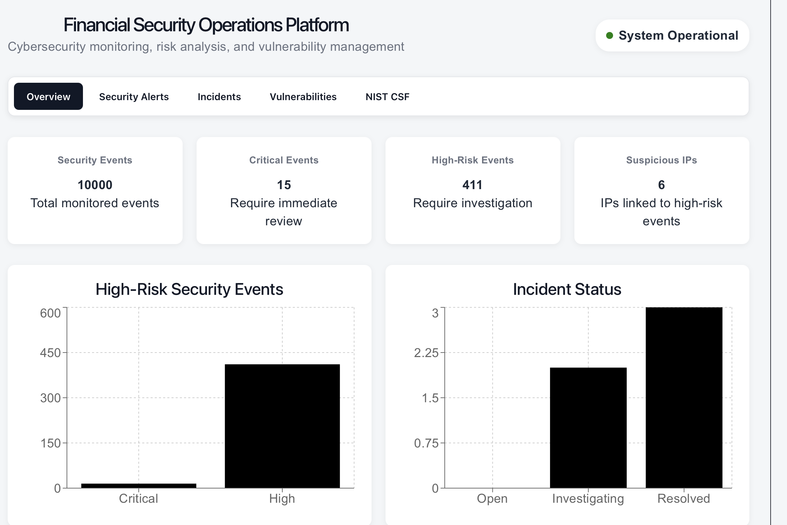
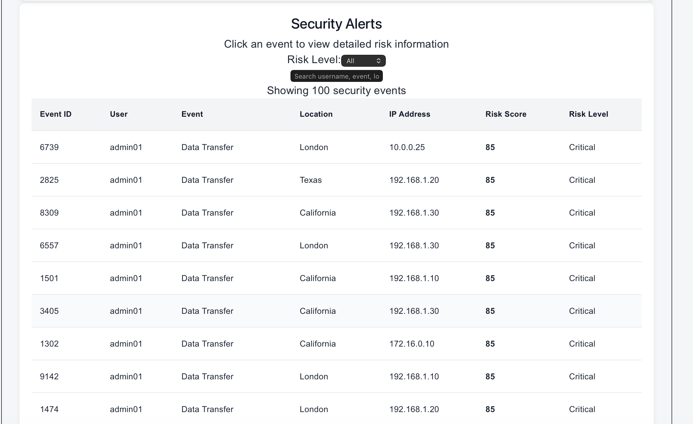
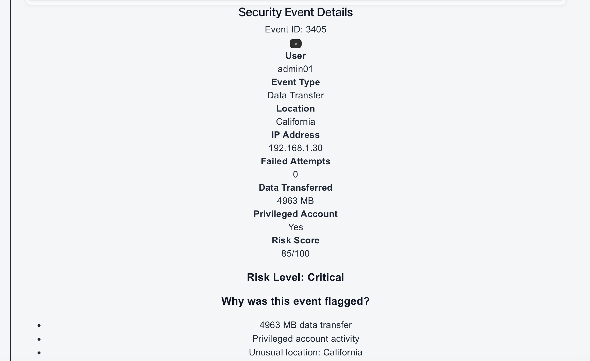
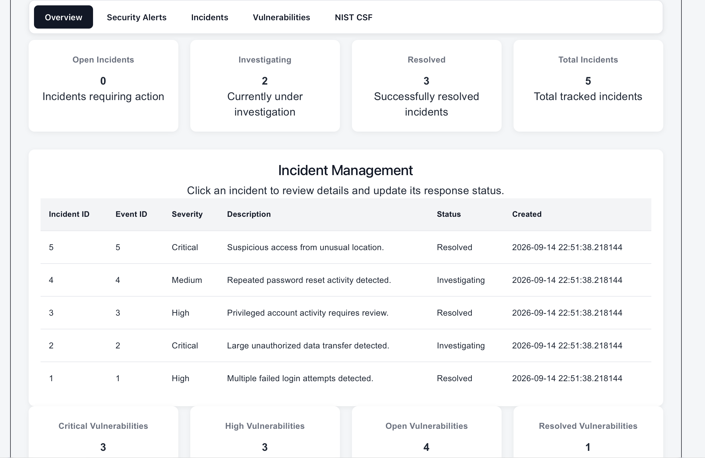
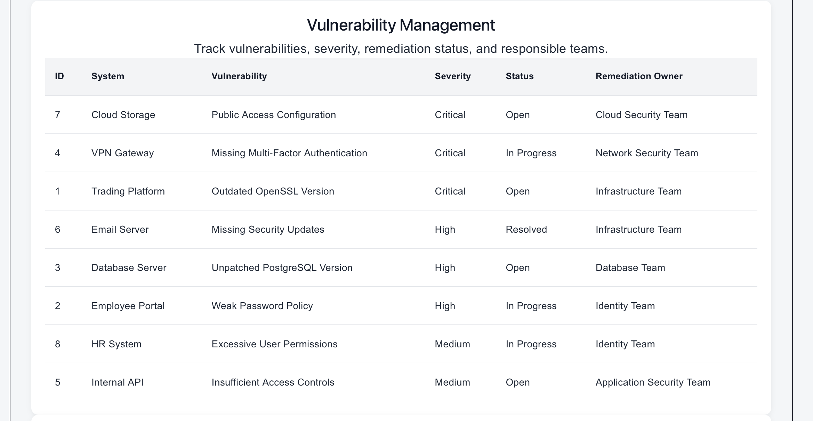
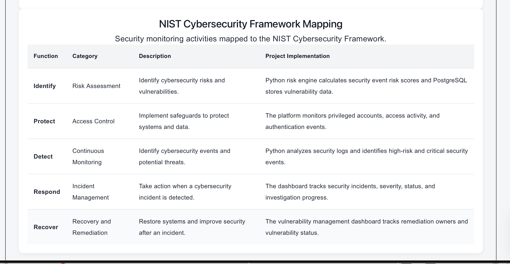

# Financial Security Operations & Risk Monitoring Platform

## Overview

The Financial Security Operations & Risk Monitoring Platform is a cybersecurity monitoring application designed to analyze simulated financial security events, identify suspicious activity, and support security operations.

The platform uses Python to analyze security logs and calculate risk scores. PostgreSQL stores security events, incidents, vulnerabilities, and NIST Cybersecurity Framework mappings. FastAPI provides the backend API, while React provides an interactive security dashboard.

## Architecture

```text
Security Logs
      ↓
Python Risk Engine
      ↓
PostgreSQL Database
      ↓
FastAPI Backend
      ↓
React Dashboard
```

## Key Features

* Analyzes 10,000 simulated security events
* Calculates cybersecurity risk scores
* Classifies events as Low, Medium, High, or Critical
* Identifies suspicious login activity
* Detects large data transfers
* Monitors privileged account activity
* Identifies unusual access locations
* Tracks security incidents and investigation status
* Tracks vulnerabilities and remediation progress
* Provides an interactive security operations dashboard
* Maps security monitoring activities to the NIST Cybersecurity Framework

## Technology Stack

* **Python** — security log generation, processing, and risk scoring
* **Pandas** — security data analysis
* **PostgreSQL** — security event, incident, and vulnerability storage
* **FastAPI** — REST API backend
* **React** — interactive dashboard
* **Vite** — frontend development environment
* **Recharts** — dashboard visualizations
* **Git/GitHub** — version control

## Risk Scoring

The Python risk engine calculates a risk score using several security indicators:

* Failed login attempts
* Privileged account activity
* Large data transfers
* Unusual locations
* Privilege changes
* Password reset activity
* File access activity

Risk levels are classified using the following thresholds:

| Risk Score | Risk Level |
| ---------- | ---------- |
| 0–29       | Low        |
| 30–59      | Medium     |
| 60–79      | High       |
| 80–100     | Critical   |

## Database

The PostgreSQL database contains tables for:

* **Security Events** — stores analyzed security activity and risk scores
* **Incidents** — tracks security incidents, severity, descriptions, and status
* **Vulnerabilities** — tracks vulnerabilities, severity, status, and remediation owners
* **NIST Controls** — maps project capabilities to the NIST Cybersecurity Framework

## NIST Cybersecurity Framework

The platform maps its security monitoring capabilities to the five NIST Cybersecurity Framework functions.

### Identify

Identifies cybersecurity risks and vulnerabilities through security event analysis and vulnerability tracking.

### Protect

Monitors authentication, access activity, and privileged accounts.

### Detect

Analyzes security logs to identify suspicious, high-risk, and critical events.

### Respond

Tracks security incidents, severity, investigation status, and resolution.

### Recover

Tracks vulnerability remediation and security improvement activities.

## Dashboard

The React dashboard provides visibility into security operations through multiple sections:

* Security Operations Overview
* Security Alerts
* Incident Review
* Incident Management
* Vulnerability Management
* NIST Cybersecurity Framework

## Dashboard Screenshots

### Security Operations Overview



### Security Alerts



### Incident Review



### Incident Management



### Vulnerability Management



### NIST Cybersecurity Framework



## Running the Project

### 1. Start PostgreSQL

Make sure PostgreSQL is running locally.

### 2. Activate the virtual environment

From the project directory:

```bash
source .venv/bin/activate
```

### 3. Generate Security Logs

```bash
python3 backend/generate_logs.py
```

This generates simulated security events in:

```text
data/security_logs.csv
```

### 4. Run the Risk Engine

```bash
python3 backend/risk_engine.py
```

This analyzes the security events and creates:

```text
data/analyzed_security_logs.csv
```

### 5. Load the Data into PostgreSQL

```bash
python3 -m backend.load_data
```

### 6. Start the FastAPI Backend

```bash
uvicorn backend.main:app --reload
```

The backend runs locally at:

```text
http://127.0.0.1:8000
```

### 7. Start the React Dashboard

Open another terminal window and run:

```bash
cd frontend
npm install
npm run dev
```

Open the local URL provided by Vite in your browser.

## Project Structure

```text
financial-security-platform/
│
├── backend/
│   ├── __init__.py
│   ├── database.py
│   ├── generate_logs.py
│   ├── load_data.py
│   ├── main.py
│   └── risk_engine.py
│
├── data/
│   ├── security_logs.csv
│   └── analyzed_security_logs.csv
│
├── database/
│
├── frontend/
│   ├── src/
│   │   ├── App.jsx
│   │   └── App.css
│   ├── package.json
│   └── vite.config.js
│
├── screenshots/
│   ├── overview.png
│   ├── security-alerts.png
│   ├── incident-review.png
│   ├── incident-management.png
│   ├── vulnerability-management.png
│   └── nist-cyber.png
│
├── tests/
│
├── .gitignore
└── README.md
```

## Project Purpose

This project was developed as a hands-on cybersecurity and data engineering project to demonstrate skills in:

* Security monitoring
* Risk analysis
* Data analysis
* Python development
* Database management
* API development
* Dashboard development
* Vulnerability management
* Incident tracking
* Cybersecurity framework mapping

The project demonstrates how security event data can be processed, stored, analyzed, and presented through a centralized security operations dashboard.
